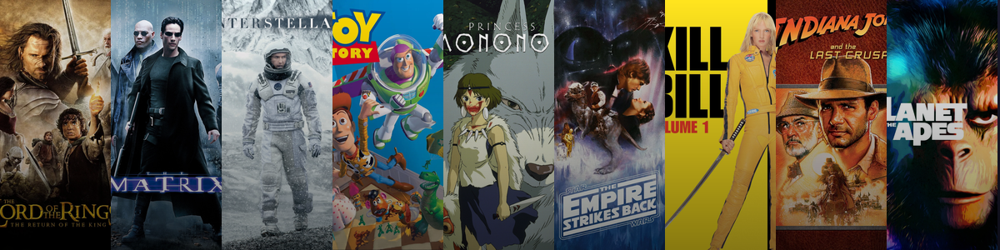
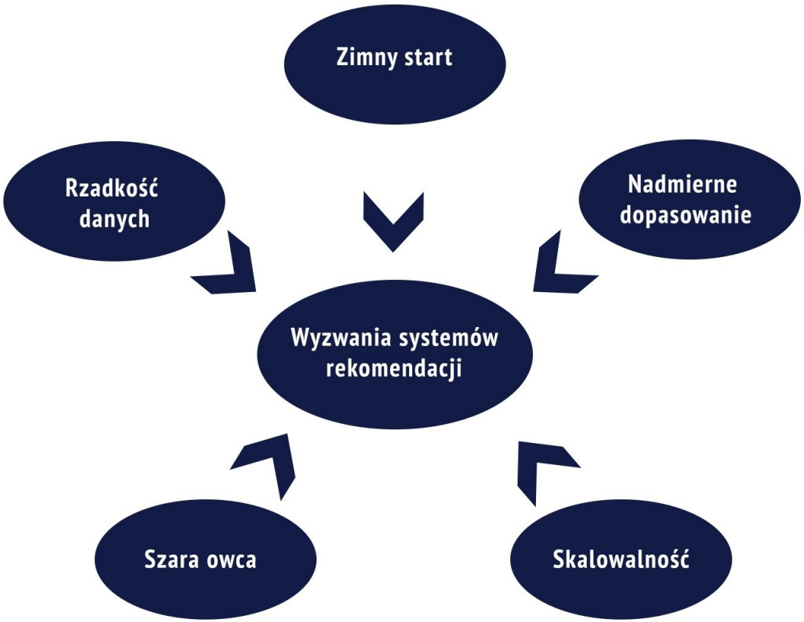

<div align="center">



# 🎬 Movie Recommendation Systems: A Comprehensive Study

> Exploring and comparing four fundamental approaches to movie recommendation systems through practical implementations and rigorous analysis.

</div>

---

## 💡 Why Recommendation Systems?

In today's digital age, **recommendation systems are everywhere**. From Netflix suggesting your next binge-watch to Spotify curating your perfect playlist, these systems shape how we discover content, products, and services. They solve a fundamental problem: **information overload** — helping users find what they need among millions of options.

**Real-world impact**:
- 📺 **Netflix**: 80% of watched content comes from recommendations
- 🛒 **Amazon**: 35% of revenue driven by recommendation engine
- 🎵 **Spotify**: Discover Weekly generates 40% of new artist discoveries
- 🎬 **YouTube**: 70% of watch time comes from recommended videos

This project explores recommendation systems through the lens of **movie recommendations**, implementing and comparing four fundamental approaches that power these real-world applications.

### 🚧 Key Challenges

Building effective recommendation systems requires addressing several critical challenges:

<div align="center">

</div>

| Challenge | Description | Impact |
|-----------|-------------|--------|
| **🥶 Cold Start** | How to recommend to new users or new items with no historical data? | New users get poor recommendations; new content remains undiscovered |
| **🎯 Over-Specialization** | System recommends only similar items, creating "filter bubbles" | Users miss diverse content; reduced serendipity and exploration |
| **📈 Scalability** | How to handle millions of users and items efficiently? | Slow recommendations; high computational costs |
| **🐑 Gray Sheep** | Users with unique tastes don't fit any group pattern | Poor recommendations for non-mainstream users |
| **📊 Data Sparsity** | Most users rate only a tiny fraction of available items | Insufficient data for accurate predictions |

**This project demonstrates** how different recommendation techniques address these challenges, with practical implementations showing their strengths and limitations.

---

## 📖 Overview

This project implements and analyzes **four major recommendation system techniques** using real-world movie datasets. Each approach is thoroughly documented with theory, implementation, and comparative analysis.

**What makes this project unique:**

- ✅ **Complete implementations** from scratch using industry-standard libraries
- ✅ **Multiple datasets** (MovieLens, Netflix, TMDB, MyAnimeList) for robust validation
- ✅ **Unified notebooks** combining theory, code, and analysis in one place
- ✅ **Production-ready code** with detailed documentation and visualizations

---

## 🔍 Recommendation Techniques

### 1️⃣ Content-Based Filtering

**Principle**: _"Recommend items similar to what you've liked before"_

Uses **TF-IDF vectorization** and **cosine similarity** to find movies with similar features (genres, cast, directors, themes).

- 📓 **Notebook**: [`content_based_filtering.ipynb`](recommendation_techniques/content_based_filtering.ipynb)
- 📊 **Datasets**: Netflix (titles catalog), TMDB, MovieLens 25M (with genome tags)
- 🎯 **Best for**: New items, transparent recommendations, niche content

**Key Insight**: Genome tags (MovieLens 25M) capture subjective qualities like "dark", "thought-provoking", enabling thematic similarity beyond metadata.

---

### 2️⃣ Collaborative Filtering

**Principle**: _"Users who agreed in the past will agree in the future"_

Implements both **memory-based** (user/item similarity) and **model-based** (SVD matrix factorization) approaches.

- 📓 **Notebook**: [`collaborative_filtering.ipynb`](recommendation_techniques/collaborative_filtering.ipynb)
- 📊 **Datasets**: MovieLens 1M, Netflix Prize, MyAnimeList
- 🎯 **Best for**: Personalization, serendipity, discovering unexpected items

**Key Insight**: SVD consistently outperforms memory-based methods, especially on sparse data (RMSE: 0.87 vs 0.96 on MovieLens).

---

### 3️⃣ Knowledge-Based Filtering

**Principle**: _"Tell me what you want, and I'll find it"_

Implements **constraint-based** (hard filters) and **case-based reasoning** (similarity + critiquing) approaches.

- 📓 **Notebook**: [`knowledge_based.ipynb`](recommendation_techniques/knowledge_based.ipynb)
- 📊 **Dataset**: TMDB (rich metadata)
- 🎯 **Best for**: No cold start, precise requirements, transparent explanations

**Key Insight**: Case-based critiquing allows iterative refinement ("like Finding Nemo, but exclude Drama/Horror") for family-friendly recommendations.

---

### 4️⃣ Hybrid Approaches

**Principle**: _"Combine the best of multiple worlds"_

Implements **three hybridization strategies**:

1. **Weighted Hybrid**: Combine CB + CF scores with tunable weights
2. **Feature Augmentation**: CB filters candidates → CF ranks them
3. **Feature Combination**: Merge CB features + CF predictions into unified space

- 📓 **Notebook**: [`hybrid_approaches.ipynb`](recommendation_techniques/hybrid_approaches.ipynb)
- 📊 **Dataset**: MovieLens 25M
- 🎯 **Best for**: Production systems, balancing accuracy and diversity

**Key Insight**: Hybrids overcome individual limitations—Feature Augmentation scales best, Weighted is simplest, Feature Combination offers highest potential.

---

## 🧮 Comparative Analysis

| Technique           | Accuracy   | Diversity | Cold Start (Users) | Cold Start (Items) | Scalability | Transparency |
| ------------------- | ---------- | --------- | ------------------ | ------------------ | ----------- | ------------ |
| **Content-Based**   | ⭐⭐⭐     | ⭐⭐      | ❌                 | ✅                 | ⭐⭐⭐⭐    | ⭐⭐⭐⭐⭐   |
| **Collaborative**   | ⭐⭐⭐⭐⭐ | ⭐⭐⭐⭐  | ❌                 | ❌                 | ⭐⭐⭐      | ⭐⭐         |
| **Knowledge-Based** | ⭐⭐⭐⭐   | ⭐⭐      | ✅                 | ✅                 | ⭐⭐⭐⭐    | ⭐⭐⭐⭐⭐   |
| **Hybrid**          | ⭐⭐⭐⭐⭐ | ⭐⭐⭐⭐  | ⚠️                 | ✅                 | ⭐⭐⭐      | ⭐⭐⭐       |

**Legend**: ✅ No problem | ❌ Problem exists | ⚠️ Partially solved

**Key Findings**:

- 🏆 **Collaborative Filtering (SVD)** achieves best accuracy on dense data
- 🎨 **Content-Based** excels at explaining _why_ items are recommended
- 🔍 **Knowledge-Based** solves cold start but requires user effort
- ⚡ **Hybrid** systems offer best overall performance in production

---

## 📁 Project Structure

```
📦 Movie Recommendation Systems
├── 📓 recommendation_techniques/
│   ├── content_based_filtering.ipynb      # Theory + 3 experiments
│   ├── collaborative_filtering.ipynb      # Theory + 6 experiments
│   ├── knowledge_based.ipynb              # Theory + 2 methods
│   └── hybrid_approaches.ipynb            # Theory + 3 hybrids
├── 📊 datasets/                           # Download using setup_datasets.py
│   ├── README.md                          # Dataset download instructions
│   ├── MovieLens/                         # 1M, 25M (with genome tags)
│   ├── Netflix/                           # Netflix Shows + Prize dataset
│   ├── TMDB/                              # Full TMDB 2024 dataset
│   └── anime/                             # MyAnimeList dataset
├── 🖼️ images/                             # Diagrams and architectures
└── 🔧 setup_datasets.py                   # Automatic dataset downloader
```

---

## 🚀 Quick Start

### 1. Install Dependencies

```bash
pip install -r requirements.txt
```

### 2. Download Datasets

**Option A: Automatic Setup (Recommended)**

```bash
python setup_datasets.py
```

This automatically downloads and sets up all datasets (~9 GB total).

**Option B: Manual Download**

See [`datasets/README.md`](datasets/README.md) for detailed instructions and download links.

**Note**: Kaggle datasets require a free Kaggle account. The setup script provides detailed instructions.

### 3. Run Notebooks

Each notebook is **self-contained** with:

- 📚 Theoretical background with mathematical formulations
- 🏗️ System architecture diagrams
- 💻 Complete implementation with detailed comments
- 📊 Results analysis with visualizations
- 🔬 Comparative evaluation

---

## 🎓 Key Takeaways

1. **No single technique is best** — each has strengths for different scenarios
2. **Hybrid systems** combine strengths and mitigate weaknesses
3. **Data quality matters** — genome tags dramatically improve content-based recommendations
4. **SVD matrix factorization** is the workhorse of modern collaborative filtering
5. **Transparency vs. Accuracy** — often a trade-off in recommendation systems

---

## 📚 Datasets Used

| Dataset              | Size                     | Features                                  | Use Case              |
| -------------------- | ------------------------ | ----------------------------------------- | --------------------- |
| **MovieLens 25M**    | 25M ratings, 62K movies  | Ratings + genome tags (1,128 tags)        | CB, Hybrid            |
| **MovieLens 1M**     | 1M ratings, 6K users     | User demographics + ratings               | CF (Memory & Model)   |
| **Netflix (Titles)** | 8.8K titles              | Title, director, cast, country, genres    | CB (metadata-based)   |
| **Netflix Prize**    | 100M ratings, 480K users | Ratings only                              | CF (large-scale)      |
| **TMDB 2024**        | 10K movies               | Rich metadata (budget, revenue, keywords) | CB, KB                |
| **MyAnimeList**      | 7.8M ratings, 12K anime  | Ratings + anime metadata                  | CF (different domain) |

---

## 🔮 Future Directions

- 🧠 **Deep Learning**: Neural collaborative filtering, autoencoders
- 🌐 **Context-Aware**: Time, location, device-based recommendations
- 📊 **Advanced Metrics**: Diversity, novelty, serendipity, fairness
- ⚡ **Real-Time Systems**: Online learning, A/B testing frameworks

---

## 👨‍💻 Author

Master's Thesis Project — _Use of methods based on user opinions for creating a movie recommendation system._

---

<p align="center">
    <strong>⭐ If you find this project useful, please consider starring it! </strong>
</p>
